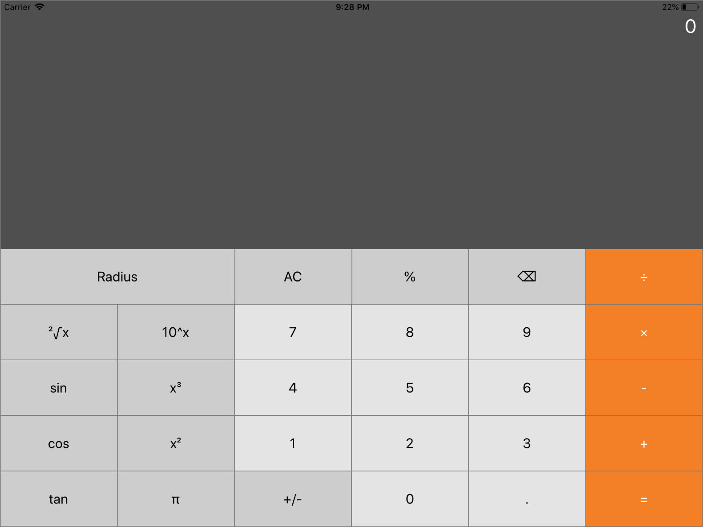

# DHA Calculator

De DHA Calculator applicatie is geschreven als eerste app van de course Develop a Hybrid App van de herfst 2018 uitvoering van de minor Mobile Application Development aan de Hogeschool van Arnhem en Nijmegen.




## Getting Started

Om aan de slag te gaan met de calculator app is het van belang dat Node.js geïnstalleerd is op de development machine. Dit wordt gebruikt om de verschillende javascript packages te beheren.

- Node.js: https://nodejs.org/dist/v8.12.0/

Wanneer Node.js geïnstalleerd is kan het onderstaande commando worden uitgevoerd. Dit commando installeert Ionic en Cordova, de frameworks die gebruikt worden door de app.

`npm install -g ionic cordova`

### Code binnenhalen

Op de volgende manier kan je de code van de app binnen halen op je ontwikkelmachine:

- Clone het git-repository of download het als zip via [deze](https://github.com/HANICA-MAD/dha-nj-2018-sander-teunissen/archive/master.zip) link en pak deze uit.
- Open een terminal venster en navigeer naar de root folder van het net gedownloade project.
- Voer het volgende commando uit: `npm install`, hiermee worden alle benodigde dependecies geïnstalleerd.


## Project structuur

```
.
 ├── resources                    # Build files van de verschillende platforms (iOS, Android) en app icons en splashscreens
 ├── src                          # Map met alle code van de applicatie
 ├── .editorconfig                # Configuratie file van de Visual Studio Code editor
 ├── .gitignore                   # Git bestand dat aangeeft welke folders niet in het repository moeten komen
 ├── .io-config.json              # Ionic ID
 ├── config.xml                   # Ionic configuratie file
 ├── ionic.config.json            # Configuratie bestand van de Ionic app
 ├── package.json                 # Node.js dependencies file
 ├── package.json                 # Node.js dependencies file
 ├── tsconfig.json                # TypeScript configuratie
 └── tslint.json                  # TypeScript linting opties
```

###src folder

```
.
   ├── ...
   ├── src                       
   │   ├── app                    # Map met globale modules en styling van de applicatie
   │   ├── assets                 # Map met alle afbeeldingen en andere assets die gebruikt worden
   |   ├── pages                  # Map met alle pagina's van de app
   |   ├── theme                  # Map met de thema's van de app
   |   ├── index.html             # Rootfile van de app
   |   ├── manifest.json          # Metadata voor de app
   │   └── service-worker.js      # Cache configuratie
   └── ...
```


## App draaien

### Draaien op ontwikkelmachine

Het is mogelijk om de app te draaien op een ontwikkelmachine en te bekijken in de browser, dit is te doen op de volgende manier:

- Open een terminal venster en navigeer naar de root folder van de app.
- Voer het volgende commando uit: `ionic serve`

De applicatie wordt vervolgens geopend in de als standaard ingestelde browser.

### Draaien op iOS apparaat

Om de applicatie te draaien op een iOS apparaat is het noodzakelijk dat Xcode geïnstalleerd is. Dit programma is te downloaden via de MacOS App Store: https://itunes.apple.com/nl/app/xcode/id497799835?mt=12. Wanneer Xcode geïnstalleerd is kan de applicatie door middel van de volgende stappen gedraaid worden op een iOS apparaat:

- Open een terminal venster en navigeer naar de root folder van de app.
- Voer het volgende commando uit: `ionic cordova build ios`. Hiermee wordt het builden van de iOS app gestart.
- Open het gegenereerde `.xcodeproj` bestand uit `platforms/ios` in Xcode.
- Click op de project naam in het linker menu, dit opent de `project editor`. 
- Selecteerd in de `general` sectie onder het kopje `signing` een developement team.
- Sluit een iOS apparaat via usb aan op de ontwikkelmachine.
- Klik op de play knop bovenin het scherm.

### Draaien op Android apparaat

Om de applicatie te draaien op een Android apparaat is het noodzakelijk dat Android Studio geïnstalleerd is. Dit programma is te downloaden via deze link: https://developer.android.com/studio/#downloads. Wanneer Android Studio geïnstalleerd is kan de applicatie door middel van de volgende stappen gedraaid worden op een Android apparaat:

- Open een terminal venster en navigeer naar de root folder van de app.
- Voer het volgende commando uit: `ionic cordova build android`. Hiermee wordt het builden van de Android app gestart.
- Zorg ervoor dat usb debugging is ingeschakeld op het Android apparaat dat gebruikt wordt. Hoe dit ingeschakeld kan worden staat hier beschreven: https://www.embarcadero.com/starthere/xe5/mobdevsetup/android/en/enabling_usb_debugging_on_an_android_device.html
- Sluit het Android apparaat via usb aan op de ontwikkelmachine.
- Voer het volgende commando uit: `ionic cordova run android`. De app wordt nu gestart op het apparaat. Als het apparaat niet gevonden wordt, voer het commando dan opnieuw uit maar voeg er
  `--device` aan toe.


